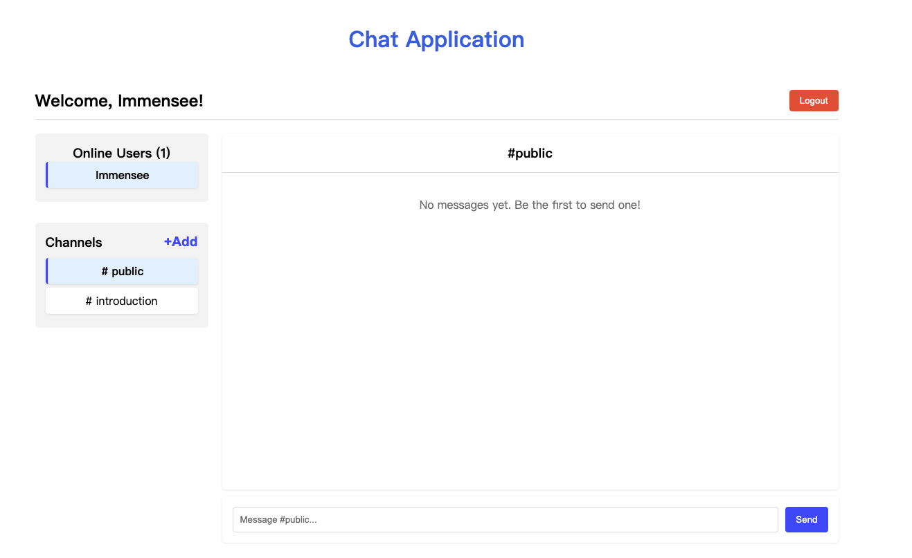
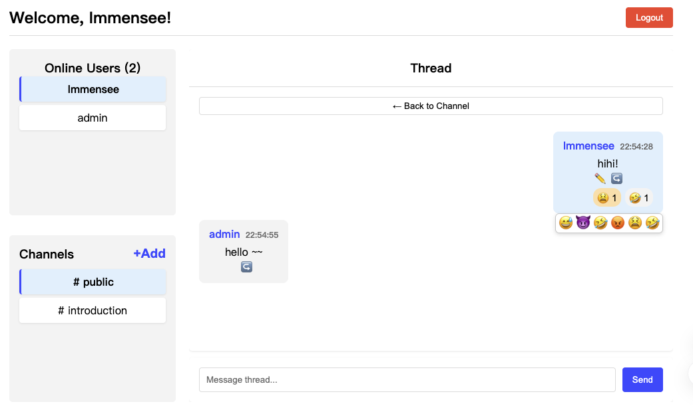
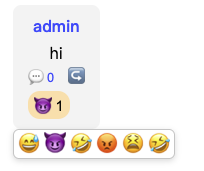
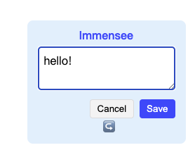

# Real-Time Chat Application
A responsive, feature-rich chat application built with React, Express, and Node.js. This single-page application demonstrates modern front-end and back-end development techniques with a focus on component-based architecture and RESTful API integration.
  
Supports:

- **Threads**: create a thread for any messages, and reply. (any user)  
- **Emoji reactions**: add or remove 😅,😡,🤣, etc for any message.  (any user)
- **Channels**: jump and chat in different channels (any user); only an `admin` user can create new channels.  
- **Forward & cite**: forward any message into current channel or thread, with optional comment. (any user)
- **Edit messages**: any user can update their own messages.

## Setting up
```bash
   git clone https://github.com/dulcimer2022/real-time-chat-app.git
   cd real-time-chat-app

   npm install
   npm run build
   npm start
```
Visit http://localhost:3000 to see the running app

## Features
### Main chat interface

### Thread View

### Emoji Reactions

### Editing Message



## Licensing
icon retreived from [Google Font](https://fonts.google.com/icons?selected=Material+Symbols+Outlined:sms:FILL@0;wght@400;GRAD@0;opsz@24&icon.query=chat&icon.size=24&icon.color=%235f6368&icon.platform=web)